<div align="center">



<br/>


</div>

<br/>

### `// stack`

```text
 TECH               STATUS
 ──────────────────────────────────────────
 C                  ●  mastering
 DSA                ●  deepening
 Computer Networks  ◐  exploring
 Bash · Git         ●  daily driver
 HTML · CSS         ○  on the side
 ──────────────────────────────────────────
 Tools: VS Code · Windows Terminal · GitHub
```

### `// stats`

<div align="center">


</div>

### `// contact`

<div align="center">

<a href="https://linkedin.com/in/Akarsit_Dubey"></a>
<a href="mailto:akasit87@gmail.com"></a>

<br/><br/>


</div>
